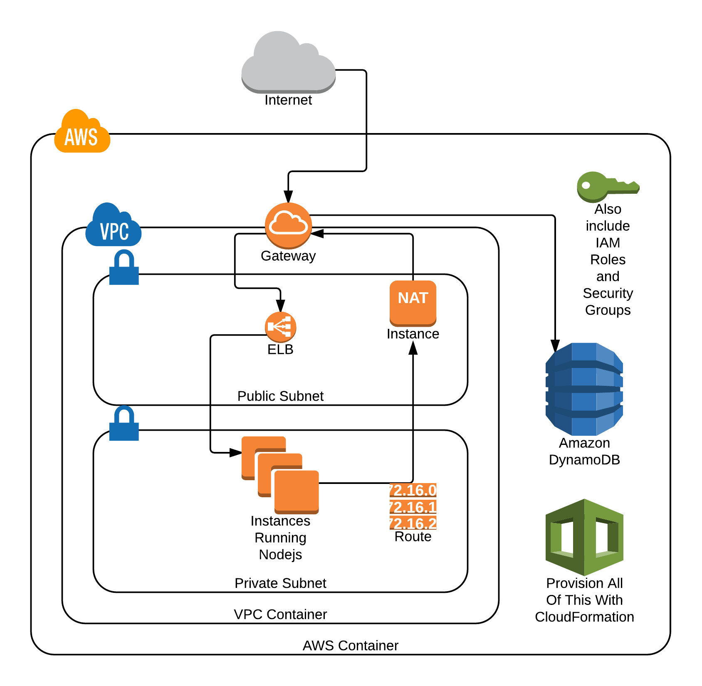

## Planning Stack Automation With CloudFormation


First, let's take a look at what we want to build. Let's assume a business gives us the following requirements:

 - Deploy **[this Todo (checklist) application](https://github.com/andrew-templeton/dynamo-demo)** onto AWS
 - Allow very simple scaling of the Compute and Database layers
 - Use AWS EC2 and AWS ELB in a VPC, and AWS DynamoDB for the Database
 - Correctly use private and public subnets
 - Make deployment of new environments very simple
 - Allow deployments into any AWS Region needed in the future
 - You do not need Multi-Availability Zone redundancy, as this is a prototype.

Our first instinct should be to draw this out, on paper or using a tool that lets us model what the infrastructure might look like. Since we see we will need to be able to easily deploy this system in any AWS Region very quickly, as well as adjust some scale aspects of the system, we should think of **AWS CloudFormation**, as this tool is designed for rapid and repeatable deployment of **Stacks** via **CloudFormation Templates**. 

This diagram is what we might draw to meet these requirements, after careful assessment...:



The architecture is the fairly straightforward setup Amazon advocates for simple web service VPC systems, albeit without multiple Availablility Zone support. The key here is that we will use CloudFormation to meet the secondary requirements for rapid deployment and ease of creation in multiple Regions.


**CloudFormation Templates** are JSON formatted files that contain, as top-level subobjects:

 - **Resources**, the *only required subobject*, which list AWS resources to build, their properties, dependencies, and so forth.
 - **Parameters**, which are inputs that configure the Template on a Stack by Stack (instantiation by instantiation) basis.
 - **Mappings**, which are objects that allow some variations based on keys - for instance, I may need a Mapping to load the correct AMIs of some kind for each region (since AMIs are region-specific).
 - **Conditions**, which allow basic conditional statements and evaluation based on **Parameters** and **Mappings**
 - **Outputs**, which allow Template developers to return data from created Stacks for use in other systems or for review by humans.


Now that we have briefly gone over the parts of a **Template** we can write, the rest of this Lab will consist of a step-by-step walkthrough, with sample code, of how to develop the diagram we have above to meet our requirements.


Since we have the diagram above for reference, we can begin planning our CloudFormation Template out by defining **Resources** that we need to drive the diagram...:

```javascript
{
	"Description": "My Cloud Academy Labs 2-Tier Scalable API Template",
	"Parameters": {
		// We will need some configurability too
	},
	"Resources": {
		// Resource definitions will go here
	}
}
```


The first group of Resources we should think about are out **networking** related Resources, since all other resources will reside inside these networking Resources. We will fill out placeholder Resources first, by defining common-sense names for what we want to use as keys on the `Resources` property, with `{}` (empty object) as the values.

First, we should plan for a **VPC** with **Private and Public Subnets**...:


```javascript
{
	"Description": "My Cloud Academy Labs 2-Tier Scalable API Template",
	"Parameters": {},
	"Resources": {
		"VPC": {},
		"PublicSubnet": {},
		"PrivateSubnet": {}
	}
}
```

These **Subnets** also need **Route Tables** and a **Network ACL**. The `PublicSubnet` will also need an **Internet Gateway**, and the `PrivateSubnet` needs a **NAT Instance**, to allow servers to access the Internet to download code and updates, as well as communicate with AWS services...:

```javascript
"Resources": {
		"VPC": {},
		"PublicSubnet": {},
		"PrivateSubnet": {},

		"GatewayToInternet": {},
		"NATInstance": {},
		"RoutesForPublicSubnet": {},
		"RoutesForPrivateSubnet": {},
		"GenericNACL": {}
	}
```

Great - now that we are starting to have a lot of **Resources**, we will be looking at only snippets of code instead of the entire **Template** at a time.

Now, we need to connect these resources together, as well as add entries to the `Routes` and `GenericNACL` Resources...:

```javascript
//... inside "Resources"
		"GatewayAttachmentToVPC": {},
		"RouteToGateway": {},
		"RouteToNat": {},
		"NACLInboundEntry": {},
		"NACLOutboundEntry": {},
		"NACLBindingForPublicSubnet": {},
		"NACLBindingForPrivateSubnet": {},
		"RoutesBindingForPublicSubnet": {},
		"RoutesBindingForPrivateSubnet": {}
//...
```

Excellent! This is a complete plan for a **VPC** setup. Let's plan for the compute resources which will reside in the VPC, namely, an **ELB**, an **Auto-Scaling Group**, and an **Auto-Scaling Launch Configuration**. Let's also add the **DynamoDB Table** to our plan...:

```javascript
// ... inside "Resources"
		"LoadBalancer": {},
		"InstancesGroup": {},
		"InstancesConfig": {},
		"DynamoTable": {}
// ...
```

These resources for ELBs, Instances, and a DynamoDB Table also need to be able to grant and receive access to each other, so let's also plan for a **Role** and an **Instance Profile** for the `InstancesConfig`, as we need to allow access to the `DynamoTable`. We also need the **Security Groups** which allow network traffic of three kinds:

 1. From the `LoadBalancer` to the `InstancesGroup` / `InstancesConfig`
 2. From the Internet to the `LoadBalancer`
 3. From the `InstancesGroup` / `InstancesConfig` to the `NATInstance`

... which looks like this...:


```javascript
// ... inside "Resources"
		"DynamoAccessRole": {},
		"DynamoAccessInstanceProfile": {},

		"LBToInstancesSecurityGroup": {},
		"InternetToLBSecurityGroup": {},
		"InstancesToNATSecurityGroup": {}
// ...
```

After we grant this access, this should be enough to build out our entire system we modeled in the diagram to meet the business requirements set forth at the beginning of the Lab. This is all of the planning we will do for our **Resources**, so it's time to proceed to the **Next Step**. 

## [NEXT](../002-networking/README.md)

If you want to check your work, the entire planning phase for the **Resources** block is below for your review...:

```javascript
{
	"Description": "My Cloud Academy Labs 2-Tier Scalable API Template",
	"Parameters": {},
	"Resources": {
		"VPC": {},
		"PublicSubnet": {},
		"PrivateSubnet": {},

		"GatewayToInternet": {},
		"NATInstance": {},
		"RoutesForPublicSubnet": {},
		"RoutesForPrivateSubnet": {},
		"GenericNACL": {},

		"GatewayAttachmentToVPC": {},
		"RouteToGateway": {},
		"RouteToNat": {},
		"NACLInboundEntry": {},
		"NACLOutboundEntry": {},
		"NACLBindingForPublicSubnet": {},
		"NACLBindingForPrivateSubnet": {},
		"RoutesBindingForPublicSubnet": {},
		"RoutesBindingForPrivateSubnet": {},


		"LoadBalancer": {},
		"InstancesGroup": {},
		"InstancesConfig": {},
		"DynamoTableForTodos": {},

		"DynamoAccessRole": {},
		"DynamoAccessInstanceProfile": {},

		"LBToInstancesSecurityGroup": {},
		"InternetToLBSecurityGroup": {},
		"InstancesToNATSecurityGroup": {}
	}
}
```
