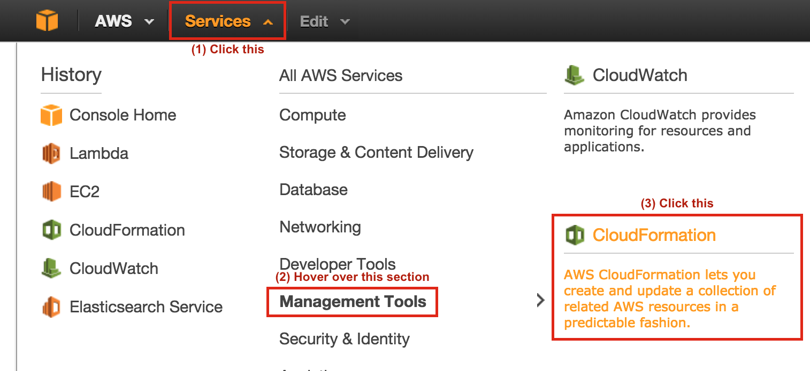
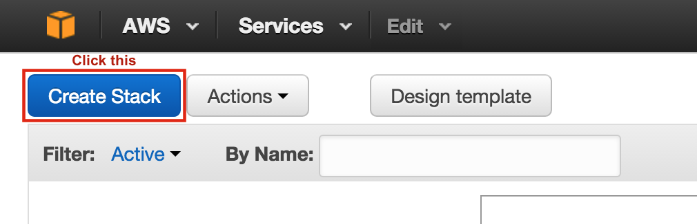
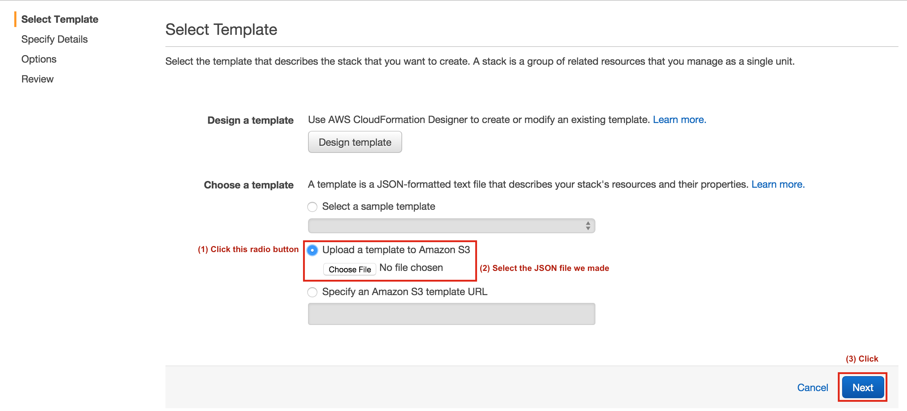
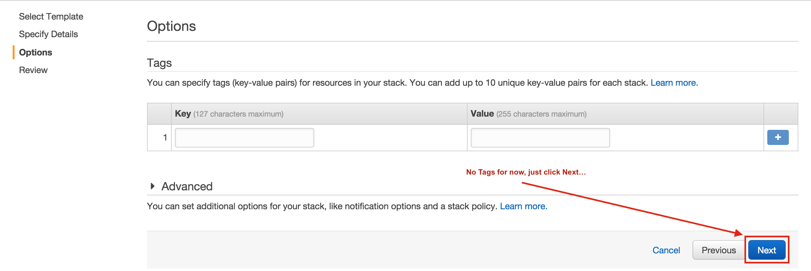
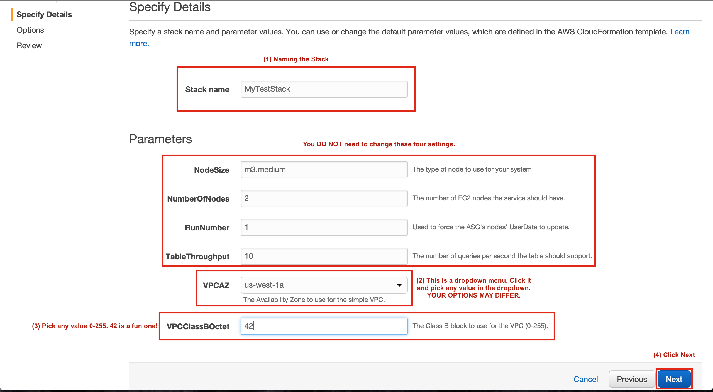
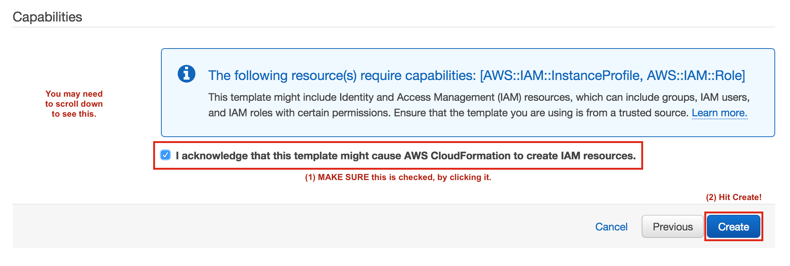
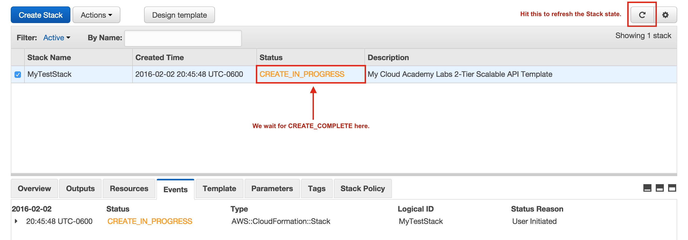
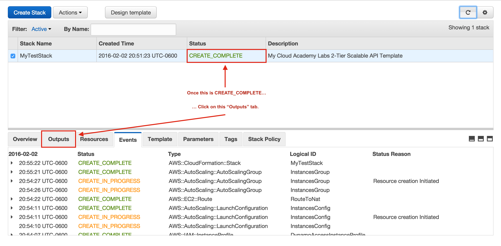
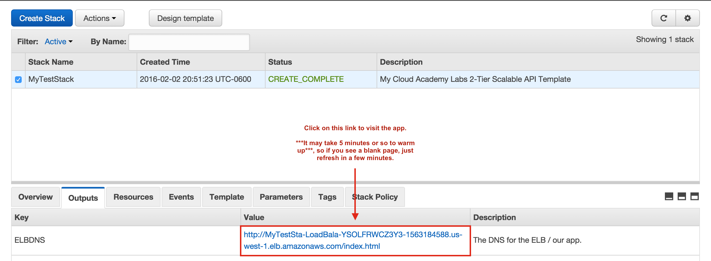
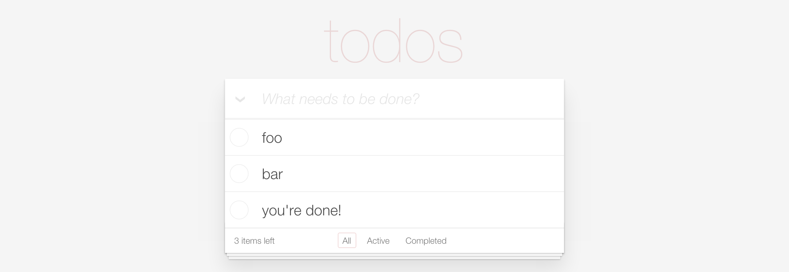

## Finally! Test The Stack!

The new **CloudFormation Template** you have defined is a highly sophisticated piece of DevOps Automation, enabling one-click scaling of both compute and database tiers, launching across a global fleet of datacenters, and multiple environments in the same Region / datacenter with ease.

A brand-new company running a Node.js application could use this template to build out and automate their entire system within a *single day*, globally, across many environments. 

Let's see how it works! We need to return to the **AWS Console** we left open from the first step, and navigate to the **AWS CloudFormation Service Console**, by clicking the **Services** dropdown in the top-left, hovering over the **Management Tools** section header label, and clicking on the **CloudFormation** item which appears...:

Then, click the blue **Create Stack** button in the top-left...:

There will be some options for how to **Select Template**. We want to **Upload a template to Amazon S3**. Click the radio button for the **Upload** option, then click **Choose File**, and pick the file we just finished creating from wherever you saved it on your computer. Once you have picked the file to upload, click the blue **Next** button in the bottom-right corner to proceed...:

We are not going to add any tags, so just hit the blue **Next** button in the bottom-right corner again to proceed...:

This page you land on is the **Parameters** configuration page. There's 4 parameters already filled in for you, you do not need to change those. You *do* need to take four (4) steps here. Steps 1 thru 3 can be performed in any order, but do step 4 last...:

 1. Set the **Stack Name**
 2. Select an **Availability Zone** for **VPCAZ**, from the dropdown. Your values will vary by Region and Account. You can pick any value in the dropdown.
 3. Pick a Class B Subnet Octet for **VPCClassBOctet**, which can be any integer 0 through 255. I picked `42` in the image randomly.
 4. Click the blue **Next** button in the bottom-right corner to confirm.

All of the information on this page is for confirmation, with the exception of the checkbox for granting **CAPABILITY_IAM**, the machine name AWS gives to the setting which allows CloudFormation stacks to create IAM resources. 

Scroll to the bottom of the page if needed, click the checkbox labeled **I acknowledge...**, then click the blue **Create** button in the bottom-right of the page to confirm - your **Stack** will begin to Create based on the **Template** written during this Lab!

You will be taken to the Stack Listing page for CloudFormation, for the Region you are working in for this Lab. The **Stack** will take some time to finish creating - usually about four (4) minutes from when you clicked Create, though this time may vary. 

While you are waiting, make note of the **Status** column in the listing user interface. We are waiting for the **Status** to reach `CREATE_COMPLETE`, which will be in green. The original value you will see after clicking Create is `CREATE_IN_PROGRESS`, which will be in yellow. 

To **Refresh** the Stack information, including the Status column, click on the **Refresh** icon in the top-right corner of the window. You may also simply refresh the browser page, but the CloudFormation refresh will be faster.

After seeing the Stack change statuses to `CREATE_COMPLETE`, click on the **Options** tab in the middle-left of the window, below the listing for the Stack.

Once you click on the **Outputs** tab, you should see one **Output**, called **ELBDNS**. Under the **Value** column for this **Output**, you should see a long link. The link is the URL for the application we launched!

The system may take about **five (5) minutes after `CREATE_COMPLETE`** to fully launch, since the code needs to download on to the EC2 instances and start accepting HTTP traffic. While this process completes, the **ELBDNS** link page may display a blank page. Just wait a little bit more and refresh the page while you wait...:

Once you wait for the page to load, you should see a To Do application! This is the open source sample project TodoMVC, which you can read more about [on their site](http://todomvc.com) if you want, though it is not required by this Lab.

You should be able to interact with this application! Now, all you need to do to launch another version or stack of this application is walk through this final step again, in another AWS account, within another Region, or even within the same Region, selecting a different Class B Octect for the VPC (the last parameter you set in the **Parameters** step during creation).

